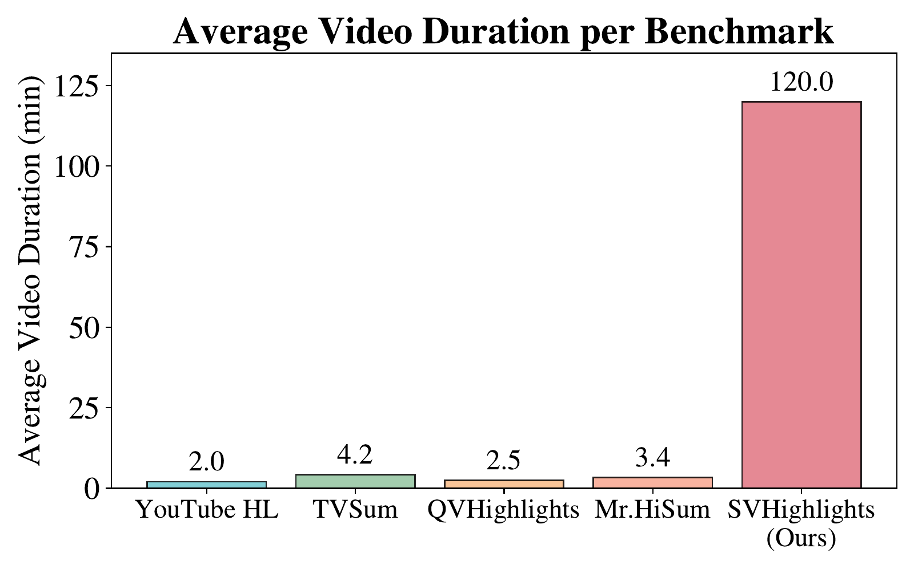
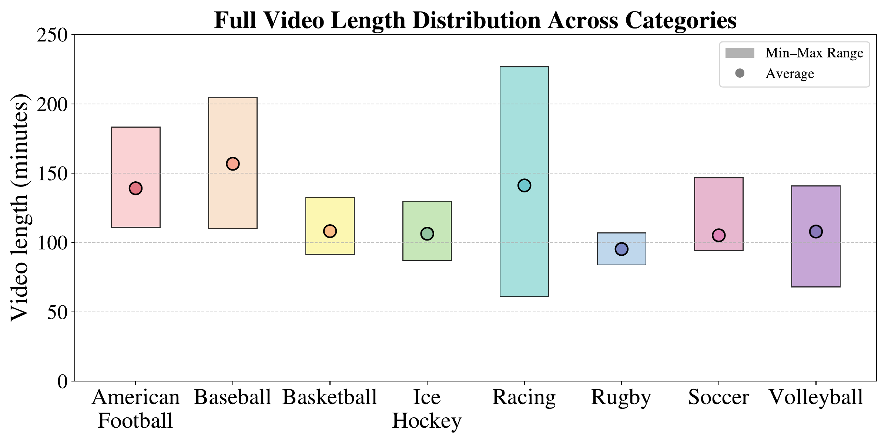
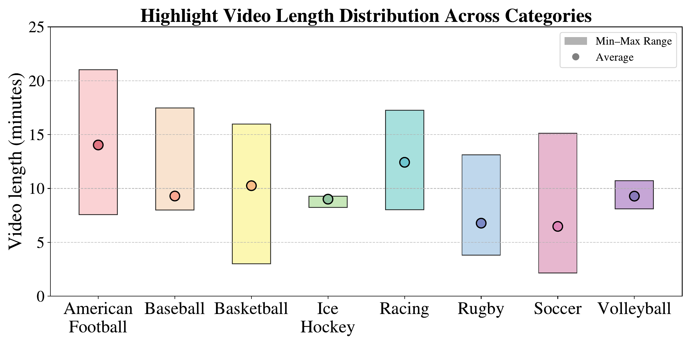
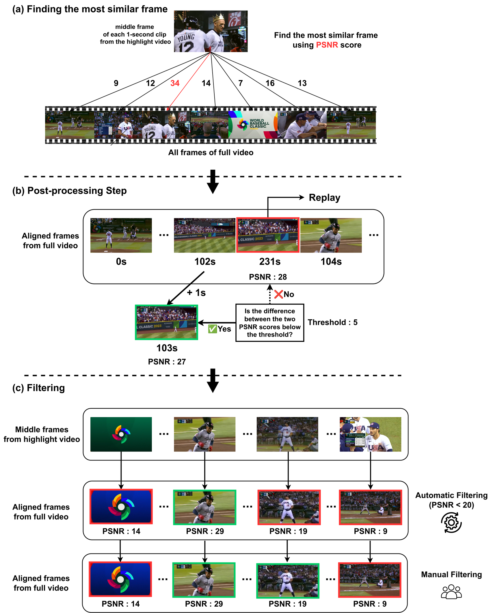
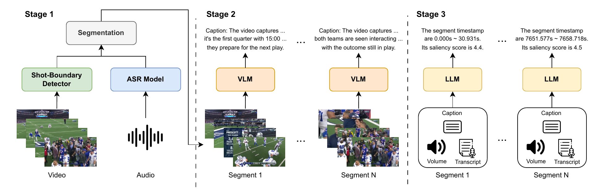

<div align="center">

# 🎬 SVHighlights: Towards Extremely Long Sport Video Highlight Detection

[](https://leedongkyu2019.github.io/SVHighlights/)
[](https://huggingface.co/datasets/idong1004/SVHighlights)
[](LICENSE)
[](https://doi.org/10.1145/3770855.3817564)
[](https://www.python.org/)

**Donggyu Lee**\* &nbsp;·&nbsp; **Youngbin Ki**\* &nbsp;·&nbsp; **Jeonghun Kang** &nbsp;·&nbsp; **Taehwan Kim**

Ulsan National Institute of Science and Technology (UNIST)

📍 **KDD 2026** &nbsp;·&nbsp; Datasets & Benchmarks Track &nbsp;·&nbsp; <sub>*equal contribution</sub>



<em>SVHighlights videos average <b>2 hours</b> — roughly 30–60× longer than existing highlight detection benchmarks.</em>

</div>

---

## 📝 Abstract

While highlight detection for long-form videos is of great practical
importance, most existing methods remain limited to short-form content, largely
due to the absence of a suitable benchmark. To bridge this gap, we introduce
SVHighlights, to the best of our knowledge, the first benchmark for highlight
detection in extremely long sports videos, each exceeding one hour in duration,
across multiple sports categories. SVHighlights is constructed from pairs of
full-length sports videos and their corresponding official highlight videos
using a highlight alignment pipeline, enabling scalable and cost-effective
label generation without conventional per-clip saliency annotation. The
benchmark comprises 320 videos spanning a wide range of sports, with an average
duration of 2.00 hours and a total of 640.18 hours, substantially exceeding
previous highlight detection datasets. Beyond the lack of benchmarks, existing
methods also face fundamental challenges on long videos: models trained on
short clips of only a few minutes fail to generalize to hour-long content, and
their clip-level scoring lacks the broader context needed to identify
highlights in long-form videos. To address these challenges and provide a
strong baseline for SVHighlights, we present TF-SELECTOR, a training-free
segment-based approach that divides each video into context-aware segments by
merging adjacent shots sharing the same semantic content, and predicts
segment-level saliency scores using a large language model (LLM) with
multimodal inputs including visual captions, transcripts, and audio volume.
Extensive experiments demonstrate that TF-SELECTOR achieves superior
performance across most evaluation metrics compared to Video Temporal Grounding
(VTG)-tuned baselines, with improvements of +3.12 in HIT@1, +4.06 in HIT@K, and
+2.95 in IoU. These results establish SVHighlights as a challenging testbed for
long-form highlight detection and demonstrate that a simple segment-based
strategy can effectively scale to hour-long videos.

## 🔥 Update

- **[2026.05.23]** 🚀 Released the SVHighlights dataset (annotations & features) on Hugging Face and the preprocessing code.
- **[2026.05.17]** 🎉 SVHighlights was accepted to **KDD 2026** (Datasets & Benchmarks Track).

## 📺 SVHighlights

SVHighlights pairs **320** full-length sports broadcasts with their official
highlight videos, spanning **8 sports** — american football, baseball,
basketball, ice hockey, racing, rugby, soccer, and volleyball (40 videos each).

<div align="center">


</div>

### Highlight alignment

Rather than relying on manual per-clip annotation, we align each official
highlight video to its full-length broadcast. Every 1-second highlight clip is
matched to the most similar full-video frame via a pixel-level **PSNR** score, a
post-processing step enforces temporal consistency, and a filtering step removes
mismatched frames.

<div align="center">

</div>

### Qualitative comparison

Each video places the **official highlight video** (left) next to the
**full-video frames aligned by our pipeline** (right) — for every highlight
second, a 1-second clip cut from the full broadcast at the frame our highlight
alignment matched.

<table width="100%">
<tr>
<td width="50%" align="center"><b>🏈 American Football</b><br><video src="https://github.com/user-attachments/assets/00203f1c-07cc-4aae-86ca-b27d0112410f" controls muted width="100%"></video></td>
<td width="50%" align="center"><b>⚾ Baseball</b><br><video src="https://github.com/user-attachments/assets/79a085b2-d753-4605-a615-c23a1277b4cd" controls muted width="100%"></video></td>
</tr>
<tr>
<td width="50%" align="center"><b>🏀 Basketball</b><br><video src="https://github.com/user-attachments/assets/20e98ad3-b1b7-4831-b9b4-ab29082ed48e" controls muted width="100%"></video></td>
<td width="50%" align="center"><b>🏒 Ice Hockey</b><br><video src="https://github.com/user-attachments/assets/112c64e8-f92a-4211-9e83-65a9a3bb7ec8" controls muted width="100%"></video></td>
</tr>
<tr>
<td width="50%" align="center"><b>🏁 Racing</b><br><video src="https://github.com/user-attachments/assets/def80680-9ff7-4811-8802-57e52a7b6d86" controls muted width="100%"></video></td>
<td width="50%" align="center"><b>🏉 Rugby</b><br><video src="https://github.com/user-attachments/assets/d43b7302-f21b-4502-b0f6-fc8c14fd93fa" controls muted width="100%"></video></td>
</tr>
<tr>
<td width="50%" align="center"><b>⚽ Soccer</b><br><video src="https://github.com/user-attachments/assets/963d97c5-db41-4a6f-b86e-f8d1e1336416" controls muted width="100%"></video></td>
<td width="50%" align="center"><b>🏐 Volleyball</b><br><video src="https://github.com/user-attachments/assets/dd024b45-91b0-4d98-a552-fab94d3716f6" controls muted width="100%"></video></td>
</tr>
</table>

## 🤖 TF-SELECTOR

**TF-SELECTOR** (**T**raining-**F**ree **S**egment-based **E**xtremely **L**ong
video highlight det**ECTOR**) is a training-free baseline with three stages:

1. **Context-aware segmentation** — shots are detected with a shot-boundary
   detector and adjacent shots that share the same spoken sentence (from an ASR
   model) are merged into coherent segments.
2. **Segment captioning** — a vision–language model (VLM) generates a textual
   description for each segment.
3. **Segment-level scoring** — a large language model (LLM) predicts a saliency
   score per segment from the caption, transcript, and audio volume; the score
   is then assigned to every clip in the segment.

<div align="center">

</div>

## 🗂️ Repository Structure

The preprocessing code is split into two parts:

- **[`benchmark/`](benchmark/)** — **SVHighlights dataset construction** (paper
  Section 3): video trimming, highlight alignment, filtering, and label
  generation, plus the alignment-quality evaluation tools.
- **[`tf_selector/`](tf_selector/)** — **TF-SELECTOR baseline preprocessing**
  (paper Section 4): shot-boundary detection, speech recognition,
  context-aware segmentation, and audio-volume extraction.

See each directory's `README.md` for the full pipeline and usage instructions.
Highlight-detection predictions are scored with **[`eval.py`](eval.py)** — see
[Evaluation](#-evaluation).

## ⬇️ Download

We do **not** redistribute the original videos. In line with the dataset's
terms of use, we release only the video URLs (`video_list.csv`), the extracted
features, and the annotation labels, as a Hugging Face dataset:

> 🤗 **<https://huggingface.co/datasets/idong1004/SVHighlights>**

```bash
huggingface-cli download idong1004/SVHighlights --repo-type dataset --local-dir ./data
```

**Annotations**

| Artifact | Produced by | Description |
|---|---|---|
| `annotations/alignment/` | `benchmark/align.py` | Per-video raw PSNR alignment between highlight clips and full-video frames. |
| `annotations/filtered_frame_idx.json` | `benchmark/filter_frames.py` + manual filtering | Final aligned frame index per highlight clip. |
| `annotations/whisper/` | `tf_selector/transcribe.py` | Word-level WhisperX transcripts. |
| `annotations/segments/` | `tf_selector/segment.py` | Context-aware segments (2-minute maximum length). |

**Features** (QVHighlights-style; `metadata_<sport>.jsonl` holds the per-clip
highlight labels)

| Feature | Directory | Extractor |
|---|---|---|
| Video — CLIP | `features/<sport>/vid_clip/` | HERO Video Feature Extractor |
| Video — SlowFast | `features/<sport>/vid_slowfast/` | HERO Video Feature Extractor |
| Query — CLIP | `features/<sport>/txt_clip/` | HERO Video Feature Extractor |
| Audio — PANN | `features/<sport>/aud_pann/` | audioset_tagging_cnn |

The query feature is the CLIP text embedding of the fixed query
*"Highlight of this {sport} video"*. Video and query features were extracted
with the [HERO Video Feature Extractor](https://github.com/linjieli222/HERO_Video_Feature_Extractor);
audio features with [PANN / audioset_tagging_cnn](https://github.com/qiuqiangkong/audioset_tagging_cnn).

## 🎮 Environment Setup

`benchmark/` and `tf_selector/` run in a **single conda environment** (named
`svhighlights` here, Python 3.9).

```bash
conda create -n svhighlights python=3.9 -y
conda activate svhighlights

# ffmpeg / ffprobe — used by almost every script
conda install -c conda-forge ffmpeg -y

# Python dependencies (covers both benchmark/ and tf_selector/)
pip install -r requirements.txt

# External packages installed from source:
pip install git+https://github.com/openai/CLIP.git        # benchmark/eval_clip_similarity.py
pip install git+https://github.com/m-bain/whisperX.git    # tf_selector/transcribe.py
git clone https://github.com/soCzech/TransNetV2           # tf_selector/shot_boundary.py
```

For GPU use, install the PyTorch build that matches your CUDA version (the
pipeline was run with PyTorch 2.4.1 / CUDA 12.1). The three external packages
are each needed by only one script — skip any you do not plan to run.

Tested with Python 3.9, PyTorch 2.4.1 (CUDA 12.1), and ffmpeg 4.2.9.

## 🚀 Usage

The preprocessing runs as two pipelines. Every script accepts `--sports` to
restrict processing to a subset of sports, and `-h` for the full argument list.

**Dataset construction** ([`benchmark/`](benchmark/README.md))

```bash
python benchmark/trim_video.py    --video_list ... --src_dir ... --dst_dir ...
python benchmark/align.py         --full_dir ... --highlight_dir ... --output_dir ...
python benchmark/filter_frames.py --alignment_dir ... --output ...
python benchmark/labeling.py      --filtered_json ... --video_dir ... --output ...
```

**TF-SELECTOR preprocessing** ([`tf_selector/`](tf_selector/README.md))

```bash
python tf_selector/shot_boundary.py  --video_dir ... --output_dir ... --transnetv2_script ...
python tf_selector/transcribe.py     --video_dir ... --whisper_dir ... --whisper_all_dir ...
python tf_selector/segment.py        --whisper_dir ... --video_dir ... --shot_dir ... --output_dir ...
python tf_selector/volume.py         --video_dir ... --output_dir ...
python tf_selector/volume_minmax.py  --volume_dir ... --output ...
```

## 📊 Evaluation

To evaluate a highlight-detection model on SVHighlights, produce a **prediction
file** with a per-clip saliency score for every video, then run `eval.py`.

**Prediction file** — a JSON list with one entry per video:

```json
[
  {
    "vid": "american_football_1",
    "pred_saliency_scores": [0.895, 0.880, 0.863, ...]
  },
  ...
]
```

- `vid` — video id (`<sport>_<idx>`)
- `pred_saliency_scores` — one predicted score per **2-second clip**, in clip
  order (each video is divided into non-overlapping 2-second clips)

**Ground-truth file** — a JSON list of `{"vid", "duration", "saliency_scores"}`,
where `saliency_scores` are the per-clip `{0, 1}` highlight labels from the dataset.

**Run:**

```bash
python eval.py \
    --submission_path path/to/predictions.json \
    --gt_path        path/to/ground_truth.json \
    --save_path      path/to/results.json
```

`eval.py` reports five metrics, computed per sport and over `all`:

| Metric | Description |
|---|---|
| `HL-mAP` | Clip-level mean Average Precision |
| `HL-Hit1` | Whether the top-scored clip is a ground-truth highlight |
| `HL-Hitk` | Hit rate among the top-K clips (K = number of GT highlight clips) |
| `HL-IoU` | Temporal overlap between the top-K predictions and GT highlights |
| `HL-wF1` | Event-level F1 with a ±3-clip window tolerance |

## 📁 Data Layout

When you run the preprocessing pipeline yourself, both `benchmark/` and
`tf_selector/` use the following working directory layout:

```
data/
├── videos/
│   ├── full_raw/            # raw downloaded full videos (input to trim_video.py)
│   ├── full/144p/           # trimmed full videos, 144p
│   ├── full/720p/           # trimmed full videos, 720p
│   └── highlight/144p/      # highlight videos, 144p
├── metadata/
│   └── video_list.csv       # columns: vid, full_start, full_end
└── annotations/
    ├── alignment/            # benchmark/align.py
    ├── filtered_frame_idx.json   # benchmark/filter_frames.py
    ├── label.json            # benchmark/labeling.py
    ├── shots/                # tf_selector/shot_boundary.py
    ├── whisper/              # tf_selector/transcribe.py
    ├── whisper_all/          # tf_selector/transcribe.py
    ├── segments/             # tf_selector/segment.py
    ├── volume/               # tf_selector/volume.py
    └── volume_norm.json      # tf_selector/volume_minmax.py
```

Videos are named `<sport>_<idx>.mp4`, where `<sport>` is one of:
`american_football`, `baseball`, `basketball`, `ice_hockey`, `race`, `rugby`,
`soccer`, `volleyball`.
